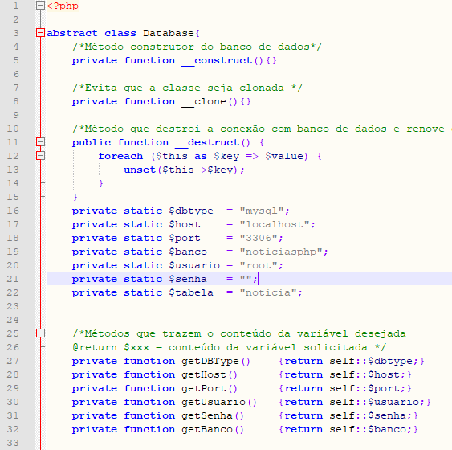

# Database connection class project
>  This class is responsible for connecting to several databases.

News descriptions: ... implementing



## Ho to use

### Prerequisites
- PHP >= 7.4.9
- PDO PHP Extension
- Composer

- **Database support:** MySQL, SQL Serve, PostgreSQL and SQLite

### Comands to use
        /* examples */
        $Create = "INSERT INTO news(title , description) VALUES ('Title 28', 'News 28')";
        $Read=    "SELECT * FROM news";
        $Update = "UPDATE news SET title='Title 27', description='News 27' WHERE id = 27 ";
        $Delete = "DELETE FROM news WHERE id = :id";

        /* instantiating the class */
        $Instance = new \App\mvc\Models\helper\Crud();

        /* Create example */
        $Instance->create($Create,$Parameters=null,$Instance);

        /* Read example */
        $Instance->read($Read, $Parameters=null,$Instance);

        /* Update example */
        $Instance->update($Update,$Parameters=null,$Instance);

        /* Delete example */
        $id = 10;
        $Parameters = array(':id' => $id);
        $Instance->delete($Delete,$Parameters,$Instance);

## Built with
- Visual Studio Code

### Language
- PHP

## Database Example
```
SET SQL_MODE = "NO_AUTO_VALUE_ON_ZERO";
START TRANSACTION;
SET time_zone = "+00:00";

DROP TABLE IF EXISTS `news`;
CREATE TABLE IF NOT EXISTS `news` (
  `id` int(11) NOT NULL AUTO_INCREMENT,
  `title` varchar(50) CHARACTER SET latin1 NOT NULL,
  `description` varchar(200) CHARACTER SET latin1 NOT NULL,
  PRIMARY KEY (`id`)
) ENGINE=InnoDB AUTO_INCREMENT=30 DEFAULT CHARSET=utf8mb4 COLLATE=utf8mb4_unicode_ci;

INSERT INTO `news` (`id`, `title`, `description`) VALUES
(1, 'Title 1', 'news 1'),
(2, 'Title 2', 'news 2'),
(3, 'Title 3', 'news 3'),
(4, 'Title 4', 'news 4'),
(5, 'Title 5', 'news 5'),
(6, 'Title 6', 'news 6'),
(7, 'Title 7', 'news 7'),
(8, 'Title 8', 'news 8'),
(9, 'Title 9', 'news 9');
COMMIT;
```

## Credits
- Antonio Carlos Dona - [acdona](https://github.com/acdona) - Code adaptation author.
- Gregory Monteiro - [devmedia](https://www.devmedia.com.br/) - Code author.


### Tanks
I thank Microsoft for making Visual Studio Code free.


## License
The structure of Database connection class is open source class licensed under the [license MIT](/LICENSE).